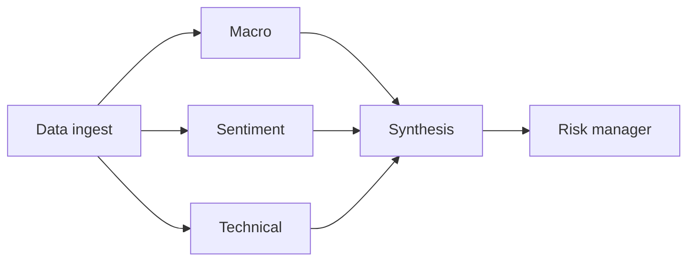

# 06 - Market Intelligence Multi-Agent Terminal

[](https://github.com/milos-plavsic/market-intel-multi-agent-terminal/actions/workflows/ci.yml)
[](https://www.python.org/downloads/)

A financial research terminal powered by specialized agents (macro, sentiment, technical, risk) that collaborate to generate scenario-aware market briefs.

## Quickstart

```bash
make install
make run
make api
make test
```

Docker API: `make docker-api`.

## API

- OpenAPI docs: `http://127.0.0.1:8000/docs`
- Health: `GET /health`
- Brief: `POST /v1/brief` with JSON body `{"ticker":"..."}`

## Architecture



## Core Capabilities

- News and market data ingestion.
- Sentiment extraction and event clustering.
- Scenario simulation (`rate hike`, `recession`, `risk-on`).
- Portfolio recommendation drafts with risk commentary.
- Backtesting snapshots against selected benchmarks.

## Architecture (Graph)

`data_ingest -> macro_agent + sentiment_agent + technical_agent -> synthesis_agent -> risk_manager -> scenario_simulator -> report_generator`
