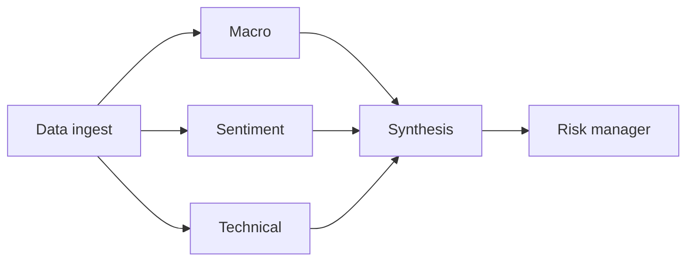

# 06 - Market Intelligence Multi-Agent Terminal

[](https://github.com/milos-plavsic/market-intel-multi-agent-terminal/actions/workflows/ci.yml)
[](https://www.python.org/downloads/)

A financial research terminal powered by specialized agents (macro, sentiment, technical, risk) that collaborate to generate scenario-aware market briefs.

## Quickstart

```bash
make install
make run
make api
make test
```

Docker API: `make docker-api`.

## API

- OpenAPI docs: `http://127.0.0.1:8000/docs`
- Health: `GET /health`
- Brief: `POST /v1/brief` with JSON body `{"ticker":"..."}`

## Architecture



## Why This Project Stands Out

- Strong product feel with practical analyst workflow.
- Multi-agent specialization is easy to demonstrate.
- Includes forecasting, risk analysis, and explainability.

## Core Capabilities

- News and market data ingestion.
- Sentiment extraction and event clustering.
- Scenario simulation (`rate hike`, `recession`, `risk-on`).
- Portfolio recommendation drafts with risk commentary.
- Backtesting snapshots against selected benchmarks.

## Suggested Tech Stack

- Python 3.11+
- `yfinance`, `pandas`, `prophet`/`statsmodels`, `langgraph`, `rich`
- Optional dashboard: Streamlit

## Architecture (Graph)

`data_ingest -> macro_agent + sentiment_agent + technical_agent -> synthesis_agent -> risk_manager -> scenario_simulator -> report_generator`

## Usage Suggestions

- Keep a daily scheduled run and publish markdown briefs.
- Add strict disclaimers and educational-only framing.
- Store generated reports for time-series quality review.

## Portfolio Additions

- Terminal-style interface with colored sections and confidence.
- "What changed since yesterday?" delta reports.
- Comparison mode across multiple sectors or tickers.

## Milestones

- `v0.1`: ingest + single-agent summary.
- `v0.2`: multi-agent synthesis and scenario simulation.
- `v0.3`: backtesting and risk overlay.
- `v1.0`: polished terminal UX and deployment.

## Demo Scenarios

1. Weekly sector rotation brief.
2. Earnings week volatility watchlist.
3. Macro regime shift impact analysis.
